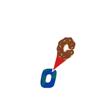

# The Snack Spot

  

The Snack Spot is a university e-commerce project dedicated to selling American snacks and beverages. The main goal is to offer users a simple, intuitive, and modern shopping experience, with particular attention to product presentation and order management.

## Main Features

- **Product Catalog**: Display of snacks and beverages, with images, detailed descriptions, and prices.
- **Shopping Cart**: Ability to add, modify, or remove products from the cart.
- **Order Management**: Simulation of the purchase process and management of placed orders.
- **Simulated Payment**: A fictitious payment system to complete transactions (without real operations).
- **Responsive Interface**: Modern design adaptable to desktop and mobile devices.

## Project Structure

The application is structured according to the Model-View-Controller pattern. The source code is located in the /src folder and includes:

- **Backend**: Management of business logic, orders, cart, and products.
- **Frontend**: Web pages to navigate the catalog, cart, and checkout, with modern graphic components.
- **Static Resources**: Images, style sheets, and other assets useful for product presentation.

## Technologies Used

- **Java 17**: Application logic
- **HTML, CSS, JavaScript**: Frontend

## Authors
- [Silvana Cafaro](https://github.com/zzzzilv)
- [Isabella Maria Sessa](https://github.com/isaboutoftown)
- [Gennaro Foglia](https://github.com/g-foglia)